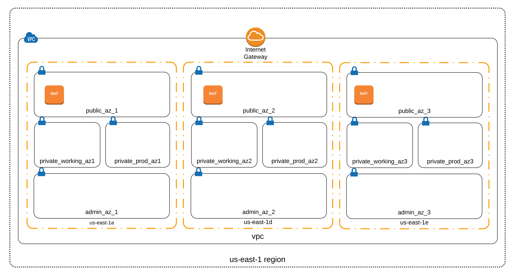

# Alibaba Cloud VPC Terraform Module

This Terraform module creates a configurable general purpose [Alibaba Cloud VPC](https://www.alibabacloud.com/help/doc-detail/34217.htm?spm=a3c0i.l27706en.a3.2.2a4a1a81UeMGUK). The module offers an opinionated but flexible network topography geared towards general purpose situations with separate public and private subnets. Each VPC can be configured to support one to four availability zones. Private subnet [NAT](https://www.alibabacloud.com/product/NAT) can be configured via [NAT Gateway](https://www.alibabacloud.com/product/NAT). A single [Internet Gateway](http://docs.aws.amazon.com/AmazonVPC/latest/UserGuide/VPC_Internet_Gateway.html) is created to provide public routing for public subnets. The module does not configure a bastion or VPN instance for private subnet instance access.

This module has been tested with Terraform version 0.7.9.

## Example VPC Layout: 3 AZ's



## Usage

* Include the module in your `main.tf`:

```
module "vpc" {
  source = "git::ssh://git@github.com/reactiveops/terraform-alicloud-vpc.git?ref=1.0.0"

  alicloud_access_key = "${var.alicloud_access_key}"
  alicloud_secret_key = "${var.alicloud_secret_key}"
  alicloud_region = "${var.alicloud_region}"

  az_count =  "${var.az_count}"
  alicloud_azs = "${var.alicloud_azs}"

  vpc_cidr_base = "${var.vpc_cidr_base}"

}
```

* Create the required variables either in `main.tf` or a separate `variables.tf` file:

```
variable "alicloud_access_key" {}
variable "alicloud_secret_key" {}
variable "alicloud_region" {}

variable "alicloud_azs" {}
variable "az_count" {}

variable "vpc_cidr_base" {}

```

* Assign variable values, for example in a `terraform.tfvars` file:

```
alicloud_azs = "cn-east-1b, cn-east-1c, cn-east-1d, cn-east-1e"
az_count = 3
vpc_cidr_base = "10.0"
```

This repo contains a few example `*.tfvars.examples` files showing example variable configurations.

## Configuration Options

### VPC IP Addresses

Generated VPC's will have a /16 CIDR block providing up to 65,536 IP addresses. Choose the IP range you want by setting the `vpc_cidr_base` variable to the first two numbers of the desired IP range. All subnets will use IP CIDR's built on this pattern.

```
vpc_cidr_base = "10.1"
```

The following vswitches will be created in each AZ:

* Public
  * Resources requiring public IP addresses such as VPN/bastion instances and Server Load Balancers.
* Private working
  * Internal non-production resources such as web servers and database instances.  Resources attached to this vswitch should have their bandwidth set to '0' to avoid alicloud assigning them a public IP.
* Private production
  * Internal production resources such as web servers and database instances.  Resources attached to this vswitch should have their bandwidth set to '0' to avoid alicloud assinging them a public IP.
* Private admin
  * Internal shared administrative resources such as build server instances.  Resources attached to this vswitch should have their bandwidth set to '0' to avoid alicloud assigning them a public IP.

Each subnet will be a /21 block providing up to 2,048 IP addresses per vswitch and AZ.

### AZ Count

Your VPC can span between one and four AZ's. You can select the specific AZ's that should be used.

```
alicloud_azs = "cn-east-1b, cn-east-1c, cn-east-1d, cn-east-1e"
az_count = 4
```

### NAT Gateways

`multi_az_nat_gateway`

Ideally, in a multi-AZ setup, there is at least one bandwidth package for the NAT Gateway residing in each availability zone.  This allows the outbound traffic from private subnets in each AZ to function independently, and allow for some resilience in-case of an AZ outage.

`single_nat_gateway`

In some cases, it may be necessary to use a single bandwidth package for the NAT Gateway, in a single AZ, to pass all outbound traffic from the VPC.  This configuration introduces a single point of failure (SPOF) in to a multi-AZ environment and should be used only when necessary.

Default values assume a multi-AZ NAT Gateway configuration:
```
variable "multi_az_nat_gateway" {
  description = "place a bandwidth package for the NAT gateway in each AZ"
  default = 1
}

variable "single_nat_gateway" {
  description = "use a single bandwidth package for the NAT gateway to serve outbound traffic for all AZs"
  default = 0
}
```

To use a single NAT gateway, set `multi_az_nat_gateway = 0` and `single_nat_gateway = 1` in `terraform.tfvars`

### Tagging

As of this writing, Alibaba Cloud does not support tagging of vSwitches via Terraform.

## Testing

This repo contains a few `.tfvars.example` files in the root illustrating different module usage configuration patterns. Each `.tfvars.example` file has a corresponding tfplan output file under `test/fixtures` representing the expected output. The project Makefile includes targets for installing a specific version of Terraform and comparing results of a `terraform plan` against expected output files.

### Setup

Running `make test` requires an actual Alicloud account for plan generation. The Alicloud account used requires read-only access to VPC/ECS resources. No changes are applied. Credentials can be set via environment variables.

```
export TF_VAR_alicloud_access_key=XXXXXXXXXXXXXXXXX
export TF_VAR_alicloud_secret_key=XXXXXXXXXXXXXXXXXXXXXXXXXXXX
```

### Executing tests

```
> make test
```

Makefile defaults expect execution on OS X. To execute on Linux:

```
> make test TF_PLATFORM=Linux
```
